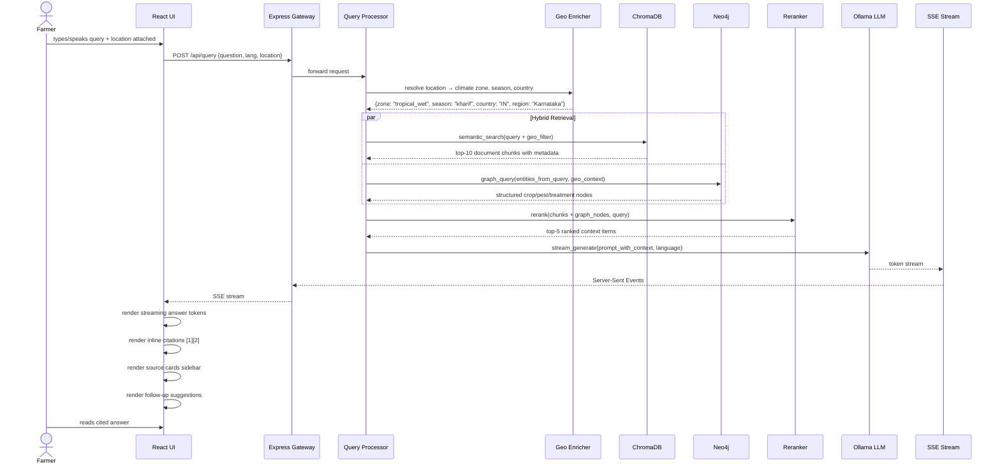
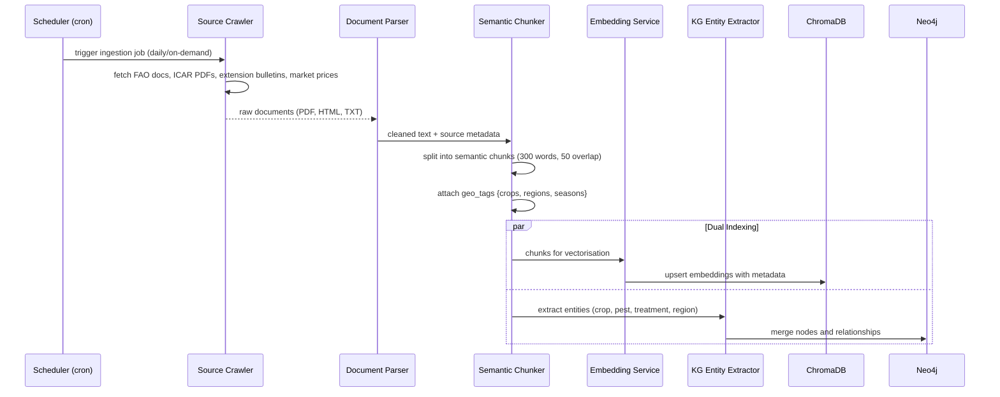
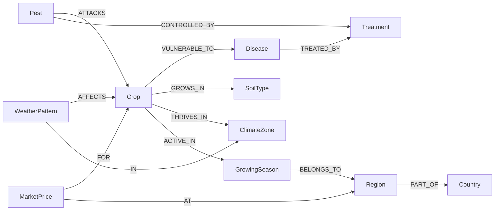
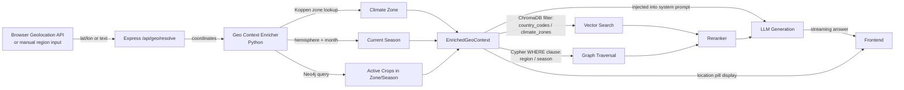

# Design Document: KrishiMitra-AI RAG/KAG Agriculture Intelligence Platform

## Overview

KrishiMitra-AI is being rebuilt as a **Perplexity-style agriculture intelligence platform** — a global, location-aware query engine for farmers and agronomists. Users type (or speak) a farming question in any of five languages and receive a streaming, cited answer synthesised from a hybrid retrieval pipeline: dense vector search over a globally-expandable knowledge corpus (RAG) combined with structured reasoning over an agricultural knowledge graph (KAG). The design retains the existing React + Express + Python + Neo4j + ChromaDB + MongoDB stack and extends it with streaming SSE, a citation engine, a global knowledge ingestion pipeline, and a Perplexity-inspired UI.

---

## Architecture

### System-Level Overview

```mermaid
graph TD
    subgraph Frontend["Frontend (React + Vite)"]
        UI[Perplexity-Style Search UI]
        Stream[SSE Stream Consumer]
        Cite[Citation Renderer]
        FollowUp[Follow-up Suggestions]
        Loc[Location Context Provider]
    end

    subgraph Backend["Backend (Express.js)"]
        GW[API Gateway]
        QueryAPI[/api/query — SSE endpoint/]
        AuthAPI[/api/auth]
        HistAPI[/api/history]
        GeoAPI[/api/geo/resolve]
    end

    subgraph MLService["ML Service (Python / FastAPI)"]
        QP[Query Processor]
        LangDetect[Language Detector]
        GeoCtx[Geo Context Enricher]

        subgraph Retrieval["Hybrid Retrieval Layer"]
            VectorSearch[ChromaDB Vector Search]
            GraphTraversal[Neo4j KAG Traversal]
            Reranker[Cross-Encoder Reranker]
        end

        subgraph Generation["Citation-Aware Generation"]
            CtxBuilder[Context Builder]
            LLM[Ollama LLM — llama3.1:8b]
            CitationEngine[Citation Extractor]
            StreamOut[SSE Token Streamer]
        end

        subgraph Ingestion["Knowledge Ingestion Pipeline"]
            Crawler[Source Crawlers]
            Chunker[Semantic Chunker]
            Embedder[Embedding Service]
            KGBuilder[KG Node Builder]
        end
    end

    subgraph DataStores["Data Stores"]
        Chroma[(ChromaDB — Vector Store)]
        Neo4j[(Neo4j — Knowledge Graph)]
        Mongo[(MongoDB — Users / History / Cache)]
    end

    subgraph ExternalAPIs["External Data Sources"]
        Weather[OpenWeatherMap / Open-Meteo]
        Market[Commodity Price APIs]
        AgDocs[FAO / CABI / ICAR / Extension Docs]
    end

    UI --> GW
    Stream --> QueryAPI
    Loc --> GW

    GW --> QueryAPI
    GW --> AuthAPI
    GW --> HistAPI
    GW --> GeoAPI

    QueryAPI --> QP
    QP --> LangDetect
    QP --> GeoCtx
    QP --> VectorSearch
    QP --> GraphTraversal
    VectorSearch --> Reranker
    GraphTraversal --> Reranker
    Reranker --> CtxBuilder
    GeoCtx --> CtxBuilder
    CtxBuilder --> LLM
    LLM --> CitationEngine
    CitationEngine --> StreamOut
    StreamOut --> QueryAPI

    VectorSearch --> Chroma
    GraphTraversal --> Neo4j
    QP --> Mongo

    Crawler --> AgDocs
    Crawler --> Weather
    Crawler --> Market
    Chunker --> Embedder
    Embedder --> Chroma
    KGBuilder --> Neo4j

    GeoCtx --> Weather
```

---

## Sequence Diagrams

### End-to-End Query Flow



### Knowledge Ingestion Pipeline



---

## Components and Interfaces

### Component 1: Perplexity-Style Search UI (React)

**Purpose**: Provide a clean, prominent search interface where farmers can ask questions and receive streaming, cited answers with suggested follow-ups.

**Key UI Regions**:
- Full-width search bar (hero, landing state)
- Streaming answer panel with inline `[1]` citation markers
- Sources sidebar showing document cards with title, excerpt, relevance score
- Follow-up question chips
- Language selector (EN / HI / KN / TA / TE)
- Location pill showing resolved region (auto-detected or manually set)

**Interface**:
```typescript
interface QueryRequest {
  question: string
  language: "en" | "hi" | "kn" | "ta" | "te"
  location: LocationContext
  sessionId: string
  followUpOf?: string  // parent query ID for threaded sessions
}

interface StreamEvent {
  type: "token" | "sources" | "followups" | "done" | "error"
  data: string | SourceDocument[] | string[] | null
}

interface SourceDocument {
  id: string
  title: string
  excerpt: string
  url?: string
  sourceType: "fao" | "icar" | "extension" | "market" | "weather" | "user_doc"
  geoRelevance: "global" | "regional" | "local"
  relevanceScore: number
  citationIndex: number
}
```

**Responsibilities**:
- Manage SSE connection lifecycle
- Render streaming tokens in real time
- Parse `[citation:id]` markers in token stream and replace with `[N]` superscripts
- Show sources panel after stream completes
- Persist query to session history
- Auto-detect browser location (with user permission) and pass to backend

---

### Component 2: Query Processor (Python / FastAPI)

**Purpose**: Orchestrate the full RAG+KAG pipeline from raw query to streamed LLM response.

**Interface**:
```python
class QueryRequest(BaseModel):
    question: str
    language: str = "en"
    location: LocationContext
    session_id: str
    follow_up_of: Optional[str] = None
    top_k: int = 5

class LocationContext(BaseModel):
    latitude: Optional[float] = None
    longitude: Optional[float] = None
    country_code: Optional[str] = None   # ISO 3166-1 alpha-2
    region: Optional[str] = None         # state/province
    climate_zone: Optional[str] = None   # resolved server-side
    current_season: Optional[str] = None # resolved server-side

async def process_query(req: QueryRequest) -> AsyncIterator[StreamEvent]:
    ...
```

**Responsibilities**:
- Detect language of query (query may arrive in one language, response in another)
- Resolve location to climate zone + growing season
- Fan out to vector search and graph traversal in parallel
- Merge and rerank results
- Build grounded prompt with numbered citations
- Stream LLM tokens with citation markers
- Emit follow-up suggestions after generation completes

---

### Component 3: Geo Context Enricher (Python)

**Purpose**: Convert raw coordinates or region names into structured agricultural context (climate zone, current season, crop calendar window) used to filter and boost retrieval.

**Interface**:
```python
class GeoContextEnricher:
    def resolve(self, location: LocationContext) -> EnrichedGeoContext: ...
    def get_current_season(self, country: str, region: str, month: int) -> str: ...
    def get_climate_zone(self, lat: float, lon: float) -> str: ...
    def get_active_crops(self, zone: str, season: str) -> List[str]: ...
```

**Responsibilities**:
- Map coordinates to Koppen climate zone (tropical, arid, temperate, etc.)
- Determine current growing season from hemisphere + month
- Query the KAG for crops active in that zone/season combination
- Return a compact `EnrichedGeoContext` object that flows into retrieval filters

---

### Component 4: Hybrid Retrieval Layer (Python)

**Purpose**: Execute semantic vector search (RAG) and structured graph traversal (KAG) in parallel, then rerank the merged candidate set.

**Interface**:
```python
class HybridRetriever:
    def retrieve(
        self,
        query: str,
        geo_context: EnrichedGeoContext,
        top_k: int = 10
    ) -> List[RetrievalResult]: ...

class VectorRetriever:
    def search(
        self,
        query_embedding: List[float],
        filters: ChromaFilter,
        top_k: int
    ) -> List[RetrievalResult]: ...

class GraphRetriever:
    def traverse(
        self,
        entities: List[str],
        geo_context: EnrichedGeoContext
    ) -> List[RetrievalResult]: ...

class CrossEncoderReranker:
    def rerank(
        self,
        query: str,
        candidates: List[RetrievalResult],
        top_k: int
    ) -> List[RetrievalResult]: ...
```

**Responsibilities**:
- `VectorRetriever`: embed query with `all-MiniLM-L6-v2`, search ChromaDB with geo metadata filters, return top-10 chunks
- `GraphRetriever`: extract named entities (crop, pest, disease, treatment) from query via spaCy NER + custom ag-domain patterns, run Cypher traversals in Neo4j to collect structured nodes as text snippets
- `CrossEncoderReranker`: pass merged candidate list through `cross-encoder/ms-marco-MiniLM-L6-v2` to produce a single ranked list; return top-5

---

### Component 5: Citation-Aware LLM Generator (Python)

**Purpose**: Build a grounded prompt with numbered source references, stream the LLM response, and extract citation usage for the frontend.

**Interface**:
```python
class CitationAwareLLMGenerator:
    async def stream_generate(
        self,
        query: str,
        context_items: List[RetrievalResult],
        geo_context: EnrichedGeoContext,
        language: str
    ) -> AsyncIterator[StreamEvent]: ...

    def build_prompt(
        self,
        query: str,
        context_items: List[RetrievalResult],
        language: str
    ) -> tuple[str, str]: ...  # (system_prompt, user_prompt)
```

**Responsibilities**:
- Number context items `[1]`, `[2]`, … and inject into prompt so the LLM can cite inline
- System prompt instructs the model to: use only provided context, cite sources as `[N]`, answer in the requested language, stay agriculture-domain-only
- Stream raw tokens from Ollama; when the full response is done, post-process to extract which citation numbers were actually used
- Emit `{ type: "sources", data: used_sources[] }` event after the token stream
- Emit `{ type: "followups", data: ["...", "..."] }` from a second lightweight LLM call

---

### Component 6: Knowledge Ingestion Pipeline (Python)

**Purpose**: Pull global agricultural content into ChromaDB and Neo4j on a scheduled or on-demand basis, attaching geographic and domain metadata for filtered retrieval.

**Interface**:
```python
class IngestionOrchestrator:
    def run(self, sources: List[IngestionSource]) -> IngestionReport: ...

class IngestionSource(BaseModel):
    name: str
    source_type: SourceType   # "pdf" | "html" | "api" | "csv"
    url: str
    geo_scope: str            # "global" | "IN" | "US" | "KE" | ...
    domains: List[str]        # ["pest_management", "crop_calendar", ...]
    refresh_interval_days: int

class DocumentChunk(BaseModel):
    id: str                   # md5 of content
    text: str
    source_name: str
    source_url: str
    source_type: str
    geo_scope: str
    country_codes: List[str]
    climate_zones: List[str]
    crops_mentioned: List[str]
    domains: List[str]
    language: str
    ingested_at: datetime
```

**Responsibilities**:
- Support file-based ingestion (existing `.txt` / `.pdf` in `knowledge_base/documents/`) with backward-compatibility
- Add HTTP-based crawlers for FAO AGRIS, CABI, ICAR, state extension services
- Enrich each chunk with `geo_scope`, `country_codes`, `climate_zones`, `crops_mentioned` metadata to enable filtered retrieval
- Deduplicate via content hash — re-ingest only changed documents
- After chunking → embed → upsert to ChromaDB, also run NER to extract entities and merge into Neo4j as nodes

---

### Component 7: Express.js API Gateway (existing, extended)

**Purpose**: Adds new SSE streaming endpoint and geo resolution endpoint to the existing Express app.

**New routes added**:
```
POST  /api/query          → streams SSE (QueryProcessor)
GET   /api/geo/resolve    → resolves coords to AgriContext
GET   /api/history        → paginated query history (MongoDB)
POST  /api/history/:id/follow-up → follow-up query linked to parent
```

**Responsibilities**:
- Proxy SSE stream from Python ML service to frontend (pass-through with auth header injection)
- Rate-limit `/api/query` at 30 req/min per user (existing `express-rate-limit`)
- Store each completed query + sources to MongoDB `queries` collection (existing `Query` model)
- Validate JWT on all protected routes (existing `auth.middleware.js`)

---

## Data Models

### Knowledge Graph Node Schema (Neo4j)



**Node: Crop**
```
{
  name: String           // "Tomato", "Rice", "Wheat"
  scientific_name: String
  crop_type: String      // "vegetable" | "cereal" | "pulse" | "oilseed" | "fruit" | "spice"
  duration_days: Integer
  water_req: String      // "low" | "medium" | "high"
  min_temp: Float
  max_temp: Float
  global_rank: Integer   // FAO production rank (for result boosting)
}
```

**Node: Disease**
```
{
  name: String
  pathogen_type: String  // "fungal" | "bacterial" | "viral" | "nematode"
  severity: String       // "low" | "medium" | "high" | "critical"
  cause: String
  symptoms: String
  spread_mode: String    // "airborne" | "soilborne" | "insect_vector" | "contact"
}
```

**Node: Pest**
```
{
  name: String
  scientific_name: String
  pest_type: String      // "insect" | "mite" | "nematode" | "rodent" | "bird"
  damage_type: String    // "leaf" | "stem" | "root" | "fruit" | "seed"
}
```

**Node: Treatment**
```
{
  name: String
  type: String           // "chemical" | "biological" | "cultural" | "mechanical"
  active_ingredient: String
  organic: Boolean
  dosage: String
  preharvest_interval_days: Integer
  countries_approved: [String]  // ISO codes — for global legality awareness
}
```

**Node: Region**
```
{
  name: String           // "Karnataka" | "Iowa" | "Rift Valley"
  country_code: String   // "IN" | "US" | "KE"
  level: String          // "district" | "state" | "country" | "continent"
  latitude: Float
  longitude: Float
}
```

**Node: ClimateZone**
```
{
  name: String           // "tropical_wet" | "semi_arid" | "temperate_continental"
  koppen_code: String    // "Af" | "BSh" | "Dfb"
  description: String
}
```

**Node: GrowingSeason**
```
{
  name: String           // "kharif" | "rabi" | "spring" | "winter" | "dry_season"
  months_start: Integer  // 1–12
  months_end: Integer
  hemisphere: String     // "northern" | "southern" | "equatorial"
}
```

**Node: MarketPrice**
```
{
  crop_name: String
  price_per_kg: Float
  currency: String       // ISO 4217
  market_name: String
  country_code: String
  recorded_at: DateTime
}
```

---

### ChromaDB Document Chunk Metadata Schema

Each vector chunk stored in ChromaDB carries the following metadata fields enabling geo-filtered and domain-filtered retrieval:

```
{
  "id": "md5_hash",
  "source": "fao_rice_production_guide.pdf",
  "title": "FAO Rice Production Guide",
  "source_url": "https://fao.org/...",
  "source_type": "fao" | "icar" | "extension" | "market" | "user_doc",
  "geo_scope": "global" | "IN" | "KE" | "US" | ...,
  "country_codes": ["IN", "BD", "VN"],
  "climate_zones": ["tropical_wet", "tropical_monsoon"],
  "crops_mentioned": ["rice", "paddy"],
  "domains": ["crop_management", "pest_management", "soil_health"],
  "language": "en",
  "chunk_index": 3,
  "ingested_at": "2025-01-15T00:00:00Z"
}
```

---

### MongoDB: Query History Document

```
{
  _id: ObjectId,
  session_id: String,
  farmer_id: ObjectId,          // ref: Farmer
  question: String,
  answer: String,               // final assembled answer
  language: String,
  location: {
    latitude: Float,
    longitude: Float,
    country_code: String,
    region: String,
    climate_zone: String,
    current_season: String
  },
  sources_used: [
    {
      source_id: String,
      title: String,
      citation_index: Number,
      relevance_score: Float
    }
  ],
  follow_up_of: ObjectId,       // null for root queries
  follow_up_questions: [String],
  model: String,
  latency_ms: Number,
  created_at: DateTime
}
```

---

### MongoDB: KnowledgeSource Document (ingestion registry)

```
{
  _id: ObjectId,
  name: String,
  source_type: String,
  url: String,
  geo_scope: String,
  domains: [String],
  last_ingested_at: DateTime,
  chunk_count: Number,
  status: "active" | "paused" | "error",
  refresh_interval_days: Number
}
```

---

## Location Context Flow

How location travels through the system end-to-end:



**Key behaviour**:
- Location is **optional** — queries work globally even without a location; geo context just boosts local relevance
- When a user in Kenya asks about maize pests, ChromaDB filters prefer `geo_scope: "KE"` chunks first, then `"global"` chunks
- The LLM system prompt always includes: `"User is in {region}, {country}. It is currently {season}. Prioritise advice relevant to their context."`
- Users can override the auto-detected location manually in the UI (a region/country selector in the search bar area)

---

## Error Handling

### Scenario 1: LLM Unavailable (Ollama down)

**Condition**: Ollama service not responding
**Response**: Stream an error `StreamEvent { type: "error", data: "AI model temporarily unavailable" }`; return the retrieval results (sources only) so the farmer still gets relevant document links
**Recovery**: Retry with exponential backoff up to 3 times; fall back to a template-based answer composed from the top-1 retrieved chunk

### Scenario 2: No Relevant Documents Found

**Condition**: ChromaDB returns all chunks with similarity < 0.4, graph traversal returns empty
**Response**: LLM is prompted with an empty context; the system prompt instructs it to say "I don't have specific information about this in my knowledge base" rather than hallucinate; return empty sources array
**Recovery**: Log the query as a "knowledge gap" in MongoDB for later ingestion prioritisation

### Scenario 3: Location Resolution Fails

**Condition**: Geolocation denied by browser, or country code unrecognised
**Response**: Proceed without geo filters; use global knowledge base; display "Global results — add your location for localised advice" in UI
**Recovery**: Offer a manual region picker in the UI

### Scenario 4: Neo4j Unavailable

**Condition**: Neo4j container unhealthy
**Response**: Skip graph traversal; fall back to RAG-only mode; log warning; do not fail the request
**Recovery**: KAG enrichment is additive, not required — RAG alone gives acceptable answers

---

## Testing Strategy

### Unit Testing

- **Query Processor**: test entity extraction, geo context injection into prompts, citation marker placement
- **Geo Context Enricher**: test Koppen zone resolution for known lat/lon pairs, season calculation across hemispheres
- **Hybrid Retriever**: mock ChromaDB and Neo4j; verify fan-out parallelism and merged ranking
- **Citation Engine**: test that `[N]` markers map correctly to source indices; test unused citations are omitted from source list

### Property-Based Testing

**Property Test Library**: Hypothesis (Python), fast-check (JavaScript)

Key properties to verify:
- For any `(query, location)` pair, the number of returned citations ≤ number of source documents provided to the LLM
- Citation indices in the answer are always a subset of `{1, …, len(context_items)}`
- Geo-filtered retrieval always returns fewer or equal results than unfiltered retrieval
- Chunking produces no empty chunks and preserves all words from the source text
- Reranker output length ≤ input length

### Integration Testing

- End-to-end SSE stream: verify `token → sources → followups → done` event sequence is always emitted in order
- Ingestion pipeline: ingest a known document, query for a term only in that document, assert it appears in top-3 results
- Knowledge graph round-trip: insert a `Crop → Disease → Treatment` triple, query via KAG service, assert full traversal returns all three nodes

---

## Performance Considerations

- **Parallel retrieval**: vector search and graph traversal run concurrently via `asyncio.gather`; combined latency ≈ max(vector_latency, graph_latency) rather than sum
- **Embedding cache**: query embeddings are cached in-process (LRU, 512 entries) to avoid re-embedding identical queries
- **Streaming UX**: SSE streaming means first token appears in ~1–2s even if full answer takes 10–15s (Ollama on local GPU/CPU)
- **Metadata-only rerank**: cross-encoder reranker operates on ≤10 candidates (5 vector + 5 graph); O(1) for practical purposes
- **ChromaDB filters**: geo metadata filters applied at query time reduce the scan space; on a 100k-chunk corpus, country-filtered queries touch ~5–10k candidates
- **Knowledge graph indexing**: Neo4j indexes on `Crop.name`, `Disease.name`, `Region.country_code` keep Cypher traversals sub-10ms

## Security Considerations

- All `/api/query` requests require valid JWT (existing auth middleware)
- Location data is only used server-side for context; raw coordinates are not stored permanently — only the resolved `{country_code, region, climate_zone}` triple is persisted in query history
- LLM output is not executed as code; the system prompt strictly scopes responses to agriculture domain and instructs the model to refuse off-topic requests
- Ingestion sources are allowlisted in MongoDB `KnowledgeSource` collection — no user-supplied URLs are crawled
- Rate limiting: 30 queries/min per user on `/api/query`; separate 5 req/min limit on `/api/query/ingest` (admin only)

## Correctness Properties

These are the invariants and behavioral guarantees the system must uphold, expressed as verifiable statements:

1. **Citation Boundedness**: For any generated answer containing citation markers `[N]`, every N satisfies `1 ≤ N ≤ len(context_items_provided_to_llm)`. The frontend never renders a citation number that has no corresponding source card.

2. **Source Non-Fabrication**: The sources returned with an answer are always drawn from the actual retrieval results for that query — never invented by the LLM. The `sources_used` list is constructed from the retrieval layer, not from LLM output parsing alone.

3. **Geo-Filter Monotonicity**: `|results_with_geo_filter| ≤ |results_without_geo_filter|` for any query. Adding location context can only narrow or maintain the candidate set, never expand it beyond the unfiltered baseline.

4. **Stream Event Ordering**: For any completed query, the SSE event sequence is always `[token*, sources, followups, done]` — source and follow-up events are never emitted before at least one token event, and `done` is always the final event.

5. **Language Pass-Through**: If the request specifies `language = "kn"`, the LLM system prompt instructs response in Kannada, and the `language` field in the stored query history equals `"kn"`. Language preference is never silently dropped or changed mid-pipeline.

6. **Chunk Completeness**: The chunking algorithm preserves all words from the source document. For any source document D, the union of all chunks derived from D contains every word in D (modulo stop-word removal, which is not applied).

7. **Idempotent Ingestion**: Ingesting the same document twice produces the same set of chunk IDs (content-addressed via MD5). The second ingestion is a no-op — chunk count in ChromaDB does not increase.

8. **KAG Graceful Degradation**: If Neo4j is unreachable, the query pipeline completes successfully using RAG alone. The response HTTP status is 200; the absence of graph enrichment is reflected only in the (potentially reduced) source list, not as an error.

9. **No Off-Domain Responses**: The LLM system prompt scopes all responses to agriculture. If a query is clearly off-domain (e.g., "write me a poem"), the answer contains an explicit refusal message and zero citation markers — the sources list is empty.

10. **Location Privacy**: Raw latitude/longitude coordinates are used transiently for geo context resolution and are never written to MongoDB. Only the resolved `{country_code, region, climate_zone, current_season}` tuple is persisted in query history documents.

---

## Dependencies

| Layer | Technology | Role | Status |
|-------|-----------|------|--------|
| Frontend | React 19 + Vite | UI framework | existing |
| Frontend | `framer-motion` | Streaming animation | existing |
| Frontend | `react-i18next` | Multilingual UI | existing |
| Frontend | `EventSource` (browser API) | SSE consumption | new usage |
| Backend | Express.js | API gateway + SSE proxy | existing, extended |
| Backend | `express-rate-limit` | Query rate limiting | existing |
| ML Service | FastAPI + uvicorn | ML API server | existing |
| ML Service | ChromaDB | Vector store | existing |
| ML Service | `sentence-transformers` `all-MiniLM-L6-v2` | Query + doc embeddings | existing |
| ML Service | `cross-encoder/ms-marco-MiniLM-L6-v2` | Reranking | **new** |
| ML Service | Ollama `llama3.1:8b` | LLM generation | existing |
| ML Service | Neo4j 5 + `neo4j` Python driver | Knowledge graph | existing |
| ML Service | spaCy `en_core_web_sm` | NER for entity extraction | existing |
| ML Service | `httpx` | Async HTTP for crawlers | existing |
| ML Service | `PyPDF2` / `beautifulsoup4` | Document parsing | existing + **new** |
| Data | MongoDB 7 | User data, query history | existing |
| Data | Neo4j 5 (APOC plugin) | Agriculture knowledge graph | existing |
| Data | ChromaDB (persistent) | Vector embeddings | existing |
| External | Open-Meteo (free) | Weather/season resolution | **new** |
| External | FAO AGRIS | Global crop documentation | **new** |
