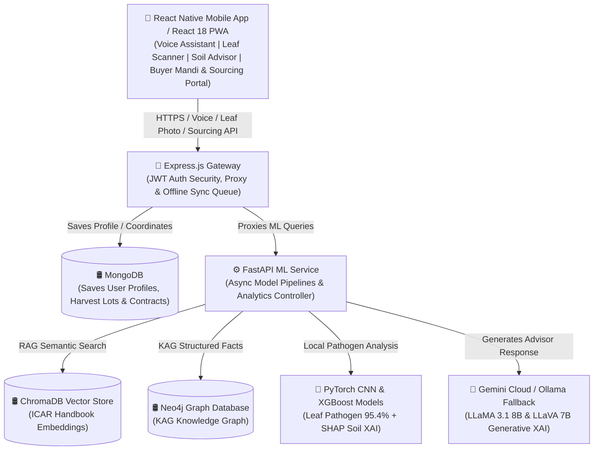

# 🌾 KrishiMitraAI

### Offline-First Agentic AI Platform for Precision Agriculture

> *Empowering Indian farmers with AI-driven agricultural intelligence — no internet required.*

**Major Project 2025-26 | Department of CSE, NCE Hassan**

---

## 🎯 Vision

KrishiMitraAI enables farmers to:
1. **Speak** in Kannada or Hindi and get AI crop/disease recommendations
2. **Upload** a leaf photo for instant disease diagnosis with expert explanation
3. **Understand** exactly *why* the AI made its recommendation (Explainable AI)
4. **Work offline** — all features available without internet after initial setup

## 🏗️ System Architecture & Methodology Diagram

### 🌐 Complete Platform Architecture Flow



---

### 📐 Standard Shape Conventions Legend

| Shape Symbol | Standard Notation | Architectural Role & Description |
| :--- | :--- | :--- |
| `[ ... ]` | **Rectangle** | **Client Apps & Processing Microservices**: React Native App, Express.js Gateway, FastAPI ML Service, CNN/XGBoost Models, Ollama/Gemini |
| `[( ... )]` | **Cylinder** | **Databases & Vector Stores**: MongoDB (Profiles/Lots), ChromaDB Vector Store (RAG Embeddings), Neo4j Graph Database (KAG) |
| `-- Label -->` | **Labeled Arrow** | **Protocol / Action Label**: Explicit grey-boxed label explaining the exact operation/data passed along each connection |

---

### 🧩 Methodology & Section Breakdown

1. **📱 React Native Mobile App / React 18 PWA**:
   - Captures voice audio in Kannada/Hindi, leaf photo matrices, soil parameters, and buyer mandi/sourcing requests.

2. **🛑 Express.js Gateway**:
   - Central entry point performing JWT authentication, request proxying, and offline transaction sync queueing.

3. **🛢️ MongoDB Database**:
   - Saves farmer profiles, geo-coordinates, harvest lot listings, and smart procurement contracts.

4. **⚙️ FastAPI ML Service**:
   - Asynchronous orchestrator dispatching ML inference and RAG/KAG retrieval tasks.

5. **🛢️ ChromaDB Vector Store**:
   - High-dimensional vector database executing semantic search across ICAR handbooks.

6. **🛢️ Neo4j Graph Database**:
   - Knowledge-Augmented Generation graph providing structured agricultural facts and crop-disease relationships.

7. **🍂 PyTorch CNN & XGBoost Models**:
   - Deep learning leaf disease classifier (95.4% accuracy) and XGBoost soil-to-crop recommender with SHAP explainability.

8. **🤖 Gemini Cloud / Ollama Fallback**:
   - Generative LLM engine (LLaMA 3.1 8B & LLaVA 7B) synthesizing grounded advisories and visual XAI narratives.

## 🚀 Quick Start

### Prerequisites
- Node.js 18+
- Python 3.10+
- [Ollama](https://ollama.com) (for local LLMs)
- Docker & Docker Compose (optional)

### Option 1: Docker (Recommended)
```bash
cp .env.example .env
docker-compose up --build
```

### Option 2: Manual Setup
```bash
# Run the setup script
chmod +x scripts/setup.sh
./scripts/setup.sh

# Or manually:
# 1. Install frontend
cd web && npm install && cd ..

# 2. Install backend
cd backend && npm install && cd ..

# 3. Install ML service
cd ml-service && pip install -r requirements.txt && cd ..

# 4. Pull Ollama models
ollama pull llama3.1:8b
ollama pull llava:7b

# 5. Start all services
# Terminal 1: cd web && npm run dev
# Terminal 2: cd backend && node server.js
# Terminal 3: cd ml-service && uvicorn main:app --reload --port 8000
```

## 🧩 Features

| Feature | Description | Offline? |
|---------|-------------|----------|
| 🤖 RAG Chat | Ask agricultural questions, grounded in ICAR/KVK documents | Partial |
| 🍂 Disease Detection | Upload leaf photo → CNN diagnosis + LLaVA explanation | ❌ |
| 📊 Crop Advisor | Soil data → XGBoost recommendation + SHAP explainability | ✅ (ONNX) |
| 🎤 Voice Input | Speak in Kannada/Hindi → Whisper transcription | ❌ |
| 📈 Market Prices | Current mandi prices from AgMarkNet | ❌ |
| 🌐 Multilingual | English, Kannada (ಕನ್ನಡ), Hindi (हिंदी) | ✅ |

## 📁 Project Structure

```
krishimitraai/
├── web/               → React PWA (Vite)
├── backend/           → Express.js API
├── ml-service/        → Python FastAPI (RAG, CNN, XGBoost, Whisper)
├── knowledge-graph/   → Neo4j Cypher schemas
├── scripts/           → Setup & training scripts
└── docker-compose.yml → Full stack orchestration
```

## 🛠️ Tech Stack

- **Frontend:** React 18 + Vite + Recharts + ONNX Runtime Web + Framer Motion
- **Backend:** Express.js + Mongoose + JWT
- **ML Service:** FastAPI + ChromaDB + sentence-transformers + XGBoost + TensorFlow
- **LLMs:** Ollama (LLaMA 3.1 8B + LLaVA 7B)
- **Databases:** MongoDB 7 + Neo4j 5
- **DevOps:** Docker Compose

## 📄 License

This project is developed for academic purposes as part of the Major Project 2025-26 at NCE Hassan.
